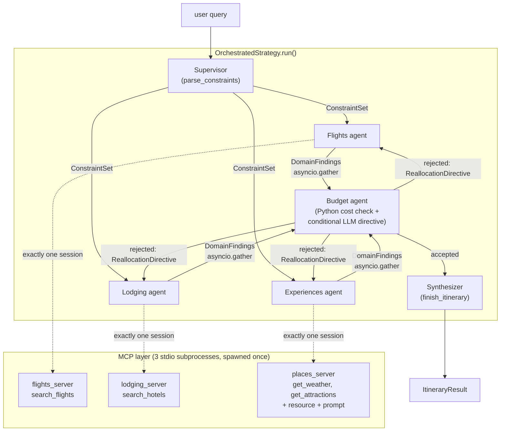

# Architecture: Why MCP, and What It Costs

This document explains the design of the `orchestrated` strategy — a multi-agent system built
on the Model Context Protocol (MCP) — and gives an honest accounting of what that architecture
buys over the four single-agent control strategies (baseline, ReAct, Plan-then-Execute,
Self-Critique), which all still call tools as direct Python function calls.

## The thesis: capability scoping enforced at the protocol boundary

The four control strategies share one tool registry. Any of them can call any of the four
tools (`search_flights`, `search_hotels`, `get_weather`, `get_attractions`) — the only thing
stopping a strategy from misusing a tool it shouldn't need is a line in its system prompt. That
line is advisory. Nothing in the code path prevents the model from calling `search_hotels` from
inside a prompt that only asked it to check the weather; if the model decides to, the call
succeeds.

`orchestrated` removes that possibility structurally instead of asking for it. Each of the
three domain agents (`src/agents/domain_agent.py`) opens exactly one MCP session — flights,
lodging, or places — and the tool list it ever sees comes from that one server's own
`list_tools()` response (`src/agents/mcp_session_manager.py`). The flights agent's Anthropic
`tools` array *is* `mcp_manager.tools_by_server["flights"]`; it is not a filtered view of a
shared registry, and there is no shared registry for it to see past. If the flights agent
wanted to call `search_hotels`, it couldn't construct a valid tool call for it — the tool
doesn't exist in its universe. The boundary is the process and protocol, not an instruction the
model can honor, ignore, or misread. This is the concrete difference between "please only use
these tools" and "these are the only tools that exist."

Two more properties fall out of the same design, at zero extra cost:

- **Process isolation.** Each MCP server (`src/mcp_servers/{flights,lodging,places}_server.py`)
  is a separate subprocess reached over stdio. A bug or crash in one server's live-mode API
  handling can't take down the orchestrator or the other two servers — contrast with the
  control strategies, where all four tools run in-process and a hard crash in one tool call
  takes the whole strategy down with it.
- **Dynamic discovery, not hardcoded schemas.** `MCPSessionManager` calls `list_tools()` once at
  startup and converts whatever comes back (`mcp_tool_to_anthropic()`, a near-direct rename —
  MCP's `input_schema` maps onto Anthropic's `input_schema`). No agent code hardcodes a tool's
  parameter shape. If a server's tool signature changes, the agent layer picks it up automatically
  on the next startup; nothing in `src/agents/` needs to change.

## System shape

Domain agents run concurrently via `asyncio.gather`. A shared `TTLCache`
(`src/agents/cache.py`), keyed on `(server, tool, normalized_args)`, is threaded through all
three and persists across the whole eval run — constructed once, not per scenario.

## Honest cost accounting: what does the IPC actually cost?

The obvious worry with wrapping tool calls in a protocol and a subprocess boundary is added
latency. Every domain-agent tool call goes through `session.call_tool()` — a JSON-RPC round
trip over stdio — instead of a bare Python method call. `OrchestrationRunStats` measures this
directly, separating `mcp_round_trip_seconds` (time inside `call_tool()`) from
`agent_reasoning_seconds` (time inside `messages.create()`), so the two are never conflated.

Measured in mock mode (Haiku, single-query runs during development):

| Query | `mcp_round_trip_seconds` | `agent_reasoning_seconds` | Ratio |
|---|---|---|---|
| Tokyo, 3 days, budget-constrained (triggered 1 reallocation round) | 0.073s | 9.548s | 0.8% |
| Paris, 4 days, budget-constrained | ~0.11s | ~19s | ~0.6% |

**In mock mode, MCP's own protocol overhead is negligible — under 1% of wall-clock time, in
every query measured.** Server startup (the one-time cost of spawning 3 subprocesses and
running `list_tools()` on each) measured 2.66s, and tool discovery itself under 0.03s; both are
one-time costs for the whole eval run, not per-scenario, and are reported separately in the
`mcp_run_summary_*.csv` companion file rather than repeated on every row.

This number needs a caveat, and it's an important one: **mock-mode tool calls are in-process
dict lookups with effectively zero latency of their own.** The 0.07–0.12s isn't "MCP is cheap"
in any general sense — it's "the fixed cost of one stdio round trip is small next to a
multi-second LLM call," which is a real and useful finding, but it says nothing about whether
MCP's overhead stays small once the *tool itself* is slow. In live mode, where `search_flights`
hits a real network API with its own multi-hundred-millisecond latency, the ratio would look
completely different — and this project's mock-mode-only eval run doesn't measure that case.
Take the finding as "the protocol tax is small," not "MCP has no downsides."

**What the architecture costs that this table doesn't show:** more moving parts. Three
subprocess lifecycles to manage cleanly (`MCPSessionManager`'s `AsyncExitStack`), a session
manager that has to exist and be threaded through `main.py`, `run_eval.py`, and `app.py`
identically, and roughly 2x the module count of the four control strategies combined. That
complexity cost is real and isn't captured by a latency column.

### Cache fairness caveat

Only `orchestrated` has a cache. The four control strategies call `BaseTool.run()` directly
with no caching layer at all — there was nothing to add one to without changing their
semantics, which was explicitly out of scope for this migration. In mock mode this makes
`cache_hit_rate` a fact about `orchestrated`'s own repeated-argument pattern within a run, not
an efficiency advantage over the controls: a mock tool call is already about as cheap as a cache
hit is, so avoiding one buys almost nothing. The cache would only become a fair,
apples-to-apples efficiency comparison in live mode, where a hit avoids a real network round
trip that the control strategies have no equivalent way to avoid either (they would need their
own cache to be comparable). Don't read `cache_hit_rate` as "the multi-agent strategy is more
efficient" — read it as "here's how often `orchestrated` happened to repeat an argument tuple
against the servers it happens to have a cache in front of."

## The confound: two axes change at once

`orchestrated` differs from every control strategy on **two independent axes simultaneously**:

1. **Multi-agent decomposition** — one supervisor + three domain specialists + a budget
   reviewer + a synthesizer, versus one agent doing everything.
2. **MCP transport** — tool calls go through a protocol and a subprocess boundary, versus a
   direct Python method call.

Any latency, token, or quality difference between `orchestrated` and the controls could come
from either axis, or from their interaction, and this project's eval design cannot separate
them. A latency regression could mean "coordinating five sub-agents is slower than one agent
looping" or "MCP's IPC is slow" or both partially — the cost-accounting numbers above suggest
the second explanation carries very little of the weight in mock mode, but that's an inference
from the IPC-overhead measurement, not a controlled test of the decomposition question in
isolation. A rigorous answer would need at least one more condition this project doesn't
build — a single agent calling tools over MCP (isolating the transport axis), or a multi-agent
system calling tools directly (isolating the decomposition axis). Absent those, treat any
`orchestrated`-vs-control comparison below as a comparison of *the whole package*, not of MCP
specifically.

## Verdict

The full 40-scenario evaluation on `claude-sonnet-5` (see the README's results table) settles
the question this project set out to ask, and the honest answer is: **`orchestrated` loses to
ReAct.** Not narrowly, and not on a technicality.

| | Goal completion | Constraint satisfaction | Avg latency | Avg tokens |
|---|---|---|---|---|
| ReAct | 100% | **95.0%** | **23.3s** | **13,697** |
| Orchestrated | 100% | 92.5% | 42.7s | 23,536 |

Orchestrated is **1.8x slower** and uses **1.7x more tokens** than ReAct, for **worse**
constraint satisfaction. Broken down by category, the gap is concentrated exactly where the
budget agent's reallocation mechanism was supposed to earn its keep: ReAct scores 80% on
budget-constrained scenarios, orchestrated scores 70%. In this eval run, only 3 of 40
orchestrated scenarios (`replan_count > 0`) ever triggered a reallocation round at all — the
mechanism mostly doesn't engage, and on the scenarios where the initial plan comes in over
budget, ReAct's ability to adapt tool-call-by-tool-call inside one continuous reasoning loop
beats the multi-agent system's coarser one-shot-then-maybe-retry structure. Self-Critique's
explicit critique-and-refine loop reaches 100% on the same category with a comparable mechanism
run through a single agent instead of five.

**Where the extra cost goes.** `orchestrated` makes a minimum of 6 LLM calls per query
(supervisor, 3 domain agents, budget check, synthesizer) versus ReAct's single continuously
looping agent — more calls means more repeated context (each domain agent re-establishes its
own system prompt and constraint restatement) and more coordination overhead (the supervisor's
constraint-extraction and the synthesizer's re-assembly are both work ReAct does implicitly,
inline, for free, as it goes). `asyncio.gather` recovers some of this: the three domain agents'
combined reasoning time averaged 15.2s wall-clock against a 36.5s serial-equivalent sum (a
**2.4x** concurrency speedup on that portion) — but that speedup is measured against
`orchestrated`'s *own* five-agent structure, not against ReAct's one-agent baseline, so it
narrows the self-inflicted overhead without coming close to erasing it.

**Isolating why, given the confound above.** The IPC-overhead numbers earlier in this document
(MCP round trips under 1% of wall-clock in mock mode) rule out the transport axis as the
explanation — `orchestrated`'s latency and token cost are a property of running five agents
instead of one, not of routing tool calls through MCP. That's a real finding, but it comes with
the caveat already stated: this project doesn't have a "multi-agent over direct calls" or
"single-agent over MCP" condition to confirm it as a controlled result rather than a strong
inference from the timing breakdown.

**What this doesn't mean.** It doesn't mean MCP was the wrong choice for this project, and it
doesn't mean multi-agent decomposition is never worth it. The capability-scoping property this
document opens with — a flights agent that structurally cannot call `search_hotels` — is real
and is not something any single-agent strategy here provides, at any latency or token cost. What
the eval shows is that *for this task* (a single itinerary, four bounded data sources, no
genuinely independent long-running subtasks), the coordination tax of five agents is not repaid
by a quality gain, and a well-designed single-agent loop with the same tools does the job better,
faster, and cheaper. A task with actually-parallel, actually-independent workstreams — the
shape multi-agent systems are built for — would very plausibly tell a different story; this one
didn't need that shape, and paid for having it anyway.

**One more honesty note, unrelated to the strategy comparison.** During this eval run,
`zero_shot_baseline` hit a run of `ItineraryResult` Pydantic validation failures — Claude
omitting required nested fields (`hotel.amenities`, `daily_plan[].estimated_cost`,
`daily_plan[].meals`) that the original schema had no default or coercion for. Each was found
and fixed in `src/models.py` as it surfaced, but the last baseline re-run was stopped before
completing a 40/40 clean pass (see the README's Results section footnote) — its numbers are
computed over 39/40 scenarios, not silently padded or estimated. This is exactly the class of
problem `ItineraryResult`'s existing forgiving-coercion pattern was designed for; the model
output that triggered it just hadn't been observed at eval scale before this run.
